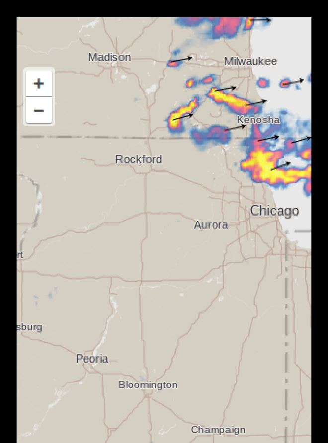

# MMM-DarkSkyRadar
MagicMirror module to get a radar map from DarkSky

https://maps.darksky.net/

## Preview


## Using the module
run git clone https://github.com/vincep5/MMM-DarkSkyRadar from inside your MagicMirror/modules folder

Add `MMM-DarkSkyRadar` module to the `modules` array in the `config/config.js` file:
````javascript
modules: [
  {
    module: "MMM-DarkSkyRadar",
    position: "top_right",
    header: "Radar",
    config: {
        lat: "41.4026",   // Latitude
        lon: "-88.8255",  // Longitude
        height: "600px",  //optional default
        width: "350px",   //optional default
        zoomLevel: 6,     //optional default (the larger the more zoomed in)
        updateInterval: 15 * 60 * 1000,  //optional default (15 minutes)
    }
  },
]
````

## Idea
A similar module to display a radar map with more options is : https://github.com/jojoduquartier/MMM-RAIN-RADAR
